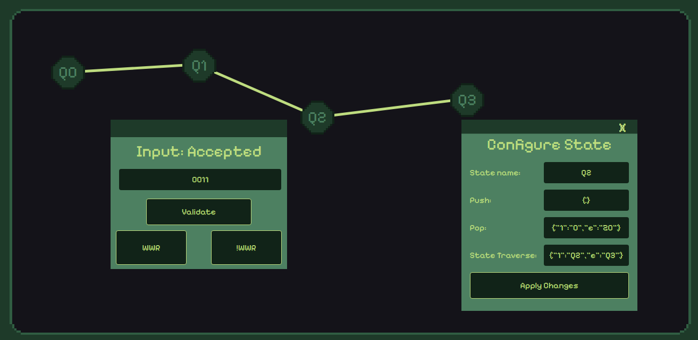

#  🛠️ Diagram Sandbox For Deterministic Pushdown Automata

This is a final project for my college's major. Issues such as nonresponsive design are caused by a lack of time polishing it. Also, it's my first project where I use drag and drop, so there would be a visible issue, such as the entire div or image not following the mouse while dragging. So far, this is my least polished project for React.

## ✨ Features
- ** 🔧 Allows user to make their own states and rules on what to push, pop, and traverse for every element.
- ** 🖱️ Can drag and drop the divs so they can be set aside and avoid blocking the states while configuring them.
- ** 🕵️‍♂️ More state detail can be seen in the console log (lack of time to finish it).

## 🚀How to use
- ** Press "P" to create the states, which can be configured by pressing the state
- ** Press "I" to open the input pop-up.
- ** Press "O" to see the state details.
- ** Press "Y" to see pre-made states.

## Sample
